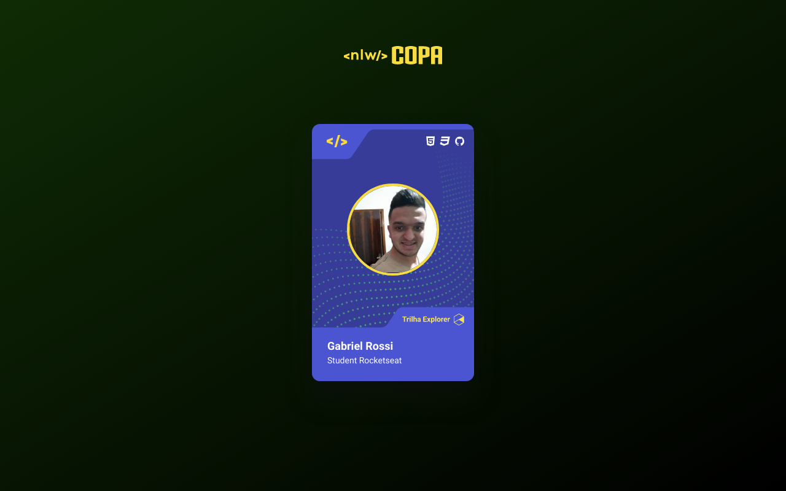

<h1 align="center">NLW CARD COPA</h1>

  <a href="#-tecnologias">Tecnologias</a>&nbsp;&nbsp;&nbsp;|&nbsp;&nbsp;&nbsp;
  <a href="#-projeto">Projeto</a>&nbsp;&nbsp;&nbsp;|&nbsp;&nbsp;&nbsp;
  <a href="#-layout">Layout</a>&nbsp;&nbsp;&nbsp;|&nbsp;&nbsp;&nbsp;

 

  

## 🚀 Tecnologias

Esse projeto foi desenvolvido com as seguintes tecnologias:

- HTML
- CSS
- JavaScript

## 🔖 Layout

Você pode visualizar o layout do projeto através [DESSE LINK](<https://www.figma.com/file/CQ4W6aNtrpQuNvpWXYXAQh/NLW-Copa-Card-(Copy)/duplicate>). É necessário ter conta no [Figma](https://figma.com) para acessá-lo.

## :rocket: Rodando o projeto

Feito com ♥ by Gabriel Rossi :wave: [Participe da nossa comunidade!](https://discord.gg/rocketseat)  

